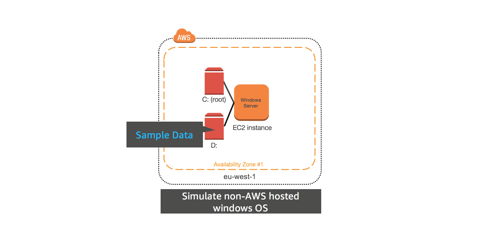
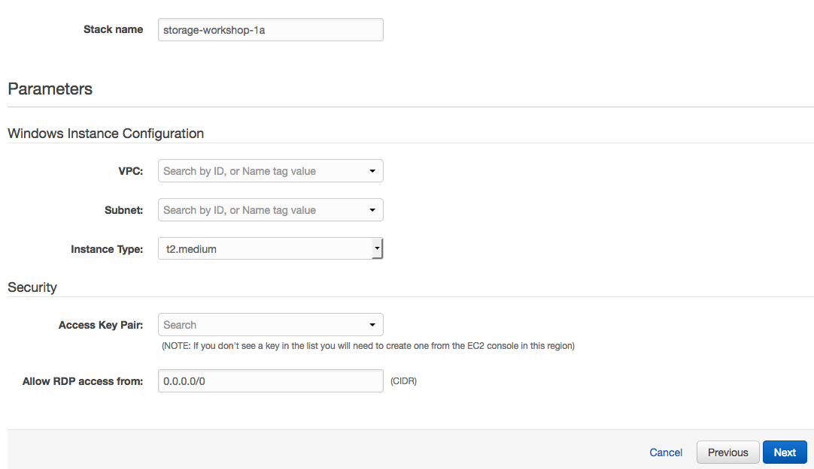
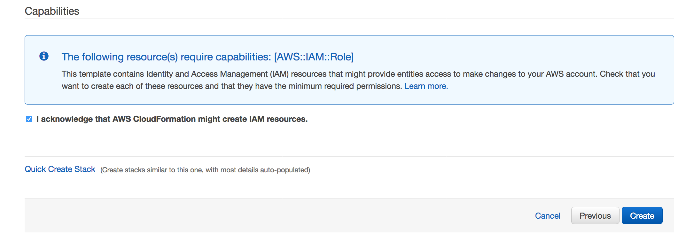
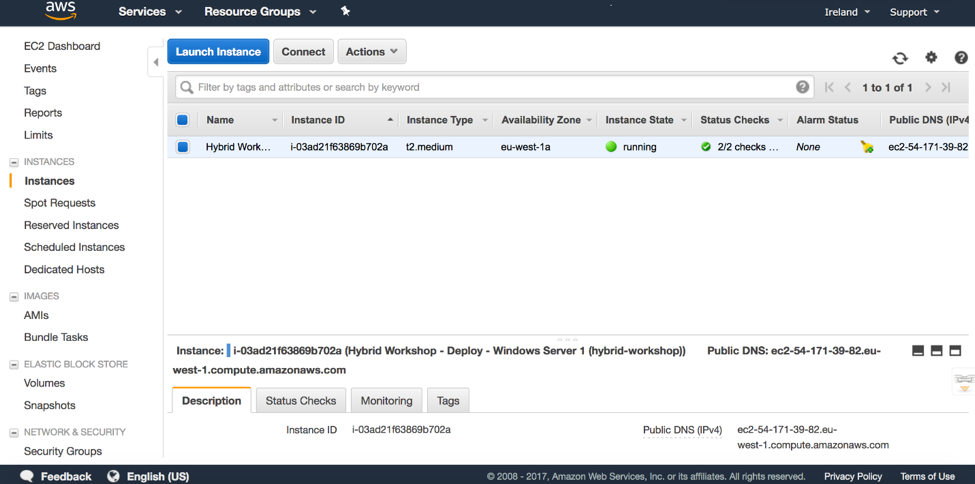
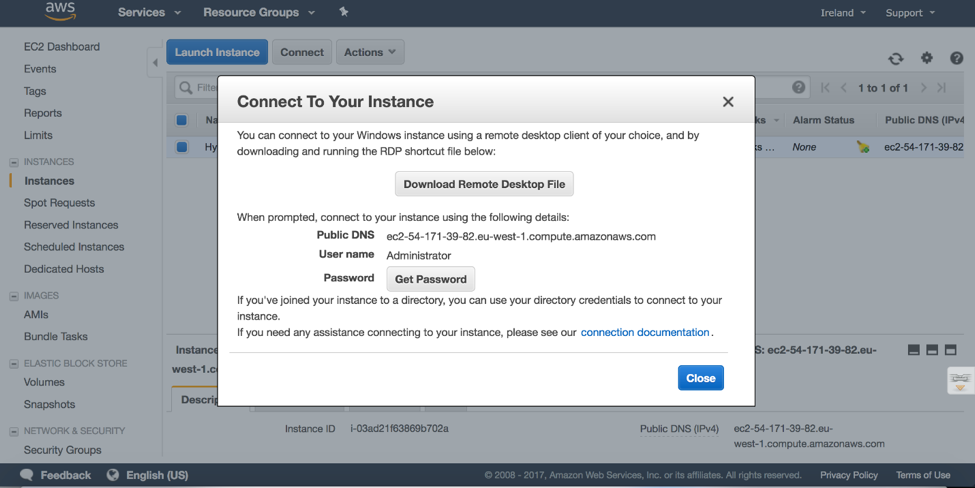
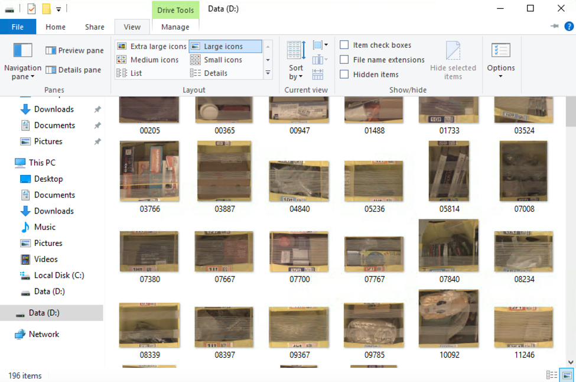

#  Deploy windows instance with sample data in eu-west-1

## Introduction

In this module, you'll deploy Windows Server to simulate on-premises server with a root volume C: (EBS) and data volume D: (EBS) in the eu-west-1 (Ireland) AWS region. The D: volume will contain 200 sample images which will be used as test data for the rest of the workshop.

## Architecture overview

### 1.	Deploy Windows Instance using CloudFormation Template

<strong>CloudFormation Launch Instructions (expand for details)</strong>

1.	Right click the **Launch Stack** link below and "open in new tab"

Region| Launch
------|-----
EU (Ireland) | .json)

2.	Click **Next** on the Select Template page.
3.	Select your default VPC and any one of the subnets within that VPC.
4.	If you already have an Access Key Pair for this region that you have access to, enter that key pair.  Otherwise, you will need to create a new key pair. ([Creating a key pair using amazon EC2](http://docs.aws.amazon.com/AWSEC2/latest/UserGuide/ec2-key-pairs.html#having-ec2-create-your-key-pair))
5.	Leave the Allow RDP access from as 0.0.0.0/0 or enter the public IP of the computer from which you plan to access the Windows server.  You can find your public IP address at http://www.whatismypublicip.com/
6.	Click **Next**.

7.	Click **Next** Again. (skipping IAM advanced section)
8.	On the Review page, check the box to acknowledge that CloudFormation will create IAM resources and click **Create**.

Once the CloudFormation stack shows a status of CREATE_COMPLETE, you are ready to move on to the next step.

## 2. Connect the EC2 instance in eu-west-1 via RDP

<strong>Connect to your EC2 instance (expand for details)</strong>

1.	From the AWS console, click **Services** and select **EC2**  
2.	Select **Instances** from the menu on the left.
3.	Wait until the newly create instance shows as *running*.

4. Right click on your newly provisoined instance and select **connect** from the menu.
5. Click **Get Password** and use your .pem to access the RDP administrator password. Keep a copy of the password for your RDP client.
6. Click **Download Remote Desktop File** and open the file with your RDP client
7. Use the password from step 5 to authenticate and connect your RDP client to your windows instance

Note: For detailed instructions on How To connect to your Windows instance using an RDP client ([Connecting to Your Windows Instance](http://docs.aws.amazon.com/AWSEC2/latest/WindowsGuide/connecting_to_windows_instance.html))

## Validation Step

<strong>Verify sample data exists on your EC2 instance (expand for details)</strong>

Once you have connected to the Windows Instance via RDP, open the File Explorer and verify that there is a C: drive and a D: drive and that there are JPEG files in the D: drive.

You now have a Windows instance in eu-west-1 that contains a boot volume and a data volume. The secondary volume and it's data will be used as sample data for the other modules in this workshop.

### Start next module

Module 2: [Migrate data to an AWS Storage Gateway volume](../module-2/README.md)

## License

This library is licensed under the Amazon Software License.

[Back to the main workshop scenarios page](../../README.md)
