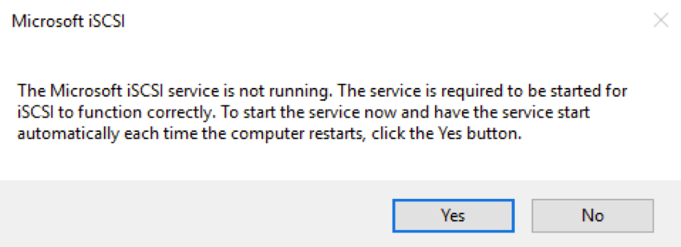
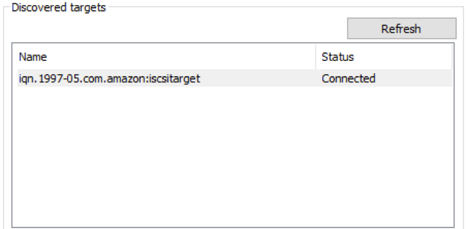

#  Migrate data to an AWS Storage Gateway volume

## Introduction

In this module, you will deploy a Volume Gateway that will allow your data to be replicated to the Frankfurt region (AWS). You will deploy the gateway into the Ireland region in the same Availability Zone as the Windows instance you launched in Module 1. The gateway is registered in the Frankfurt region, however, and that is where the data will be stored for all volumes created on this gateway. 

You will launch this AWS CloudFormation template in the eu-west-1 region to build the necessary resources automatically. This template will create a Storage Gateway in the Frankfurt (eu-central-1) region, but deploy it in EC2 in the Ireland region so it can be attached to your new Windows instance. The gateway will be activated by the template and the appropriate security group will be attached.

## Architecture overview


### 1.	Deploy Windows Instance using CloudFormation Template

<details>
<summary><strong>CloudFormation Launch Instructions (expand for details)</strong></summary><p>

1.	Right click the **Launch Stack** link below and "open in new tab"

Region| Launch
------|-----
EU (Ireland) | [](https://console.aws.amazon.com/cloudformation/home?region=eu-west-1#/stacks/new?stackName=storage-workshop-1b&templateURL=https://s3-us-west-2.amazonaws.com/hybrid-storage-workshop/scenario1-step2-migrate-SGW1-(eu-west-1).json)

2. Click **Next** on the Select Template page.
3. Select your default VPC and any one of the subnets within that VPC.
4. If you already have an Access Key Pair for this region that you have access to, enter that key pair.  Otherwise, you will need to create a new key pair.  Instructions to create a new key pair.
5. Select a subnet from the drop-down list.
5. Leave Instance Type, Gateway Cache Disk Size and Gateway Upload Buffer Disk Size at default values.
6. Choose a size for your volume that will be created on the gateway. It should be large enough to hold the data that you have on the D: drive of win1 instance you created in Module 1.
7. Leave the Activation Region at eu-central-1
8. Select the keypair that you used in Module 1
9. Select the Security Group that was created in Module 1 named "storage-workshop-1a-win1SecurityGroup...". This will allow our windows instance network access (iSCSI) to the gateway that is soon to be deployed in the same VPC.
10.	Click **Next**.
11.	Click **Next** Again. (skipping IAM advanced section)
12.	On the Review page, check the box to acknowledge that CloudFormation will create IAM resources and click **Create**.


Once the CloudFormation stack shows a status of CREATE_COMPLETE, you are ready to move on to the next step.
</p></details>

## 2. Verify the gateway is active and get its IP Address

<details>
<summary><strong>Verify gateway and get IP (expand for details)</strong></summary><p>

1. From the **Services** drop-down, select **EC2**.
2. You should see a new c4.2xlarge instance with the name "Hybrid Workshop - Migrate - Gateway Server 1 (storage-workshop-1b)"  in a *running* state.
3. Refresh the instance view periodically (every 30 seconds) until you see the word *Activated* in the EC2 instance name.
4. From the Services drop-down, select **Storage Gateway**.

Note: You will not see the gateway that was just provisioned here. While, we deployed the gateway into EC2 in the EU (Ireland) region, the gateway was activated in the EU (Frankfurt) region, so that is where we will find the gateway, and that is where the data written to it will be stored.

5.	Click on **Ireland** in the upper-right corner and select **EU (Frankfurt)** from the list to switch the console to the eu-central-1 region.

You will now see the Gateway that you just provisioned listed. Verify that their is a gateway named "Hybrid-Workshop-Gateway-Server-1...." and its status is *Running*.

6.	Click on the gateway to reveal the Details tab below. From the Details tab, make note of the *IP address* of the gateway and write it below. (We will use that address to connect our windows client to the storage gateways iSCSI interface.

7.	Click Volumes from the left menu to see the volume that was created by the CloudFormation stack. The size should match what you specified in the configuration (1-5 GiB).
</p></details>

## 3. Connect the windows server to the gateway volume

<details>
<summary><strong>Connect windows to gateway (expand for details)</strong></summary><p>

1.	Now comes the fun part! We will now attach the volume from your Volume Gateway Service in Frankfurt to your Windows instance in Ireland, giving that instance access to both local cache storage in that Ireland at the same time as remotely writting all of its data to Frankfurt. 

2. Return to your Windows instance, and open the iSCSI Initiator utility by clicking the Windows logo in the bottom left corner and typing ‘iscsi’ and then clicking iSCSI Initiator from the search results.

3. Click ‘Yes’ if prompted to enable the iSCSI service in Windows



4.	In the Targets tab of the iSCSI Initiator Properties window, enter the IP address that you wrote down for your Volume Gateway in the Quick Connect section and click the ‘Quick Connect’ button. 

You should see a target listed now with Connected status:



Your Windows instance is now connected with the Volume Gateway via iSCSI and the only volume that exists has been discovered by Windows and connected.

Now we need to configure the volume for storage!

23.	Click OK to close the iSCSI Initiator Properties window and open Computer Management by clicking the Windows logo in the lower-left corner and typing ‘Computer Management’ then clicking that from the search results.

Once it opens, select the Disk Management module. You will see a new Offline Disk 2 of Unknown type. This is your volume from the Volume Gateway. The size should match the volume size on your gateway. However, since Volume Gateway is presenting this as raw block storage (like a new SAN volume would look in a traditional datacenter), we need to bring it online and format it so Windows can use it.

24.	To format the new volume, first we need to bring it online by right-clicking the section describing the disk and selecting Online.


25.	After it is online, right-click the disk again and select Initialize Disk. Leave all the default settings and click OK.
26.	Now click in the blank white space of the disk and select New Simple Volume.
27.	Click Next on the first page of the New Simple Volume Wizard.
28.	Leave the default to allocate all available storage to the new volume and click Next.
29.	Leave the default setting to mount the new volume as the E: drive and click Next.
30.	Leave the default settings of NTFS and the Default unit allocation size. You can change the Volume Label if you’d like, but leave the box checked for Quick Format, and click Next and then Finish to format the disk.

31.	You can now open File Explorer and see the new E: drive. Let’s copy our data over to the gateway volume. Open Command Prompt and use robocopy to mirror your D: drive to the newly mounted E: drive:

robocopy d: e: /MIR

Check the E: drive in File Explorer and you should see all of the data that was on D: also on E: now. 

```
What just happened?

When you copied the data from the D: drive to the E: drive within your Windows instance, underneath Windows, you copied the data from your Windows instance’s EBS volume to the Volume Gateway. When this happened, the gateway received the data into its local cache, and then began to copy the data up to S3 in the Frankfurt (eu-central-1) region via its local Upload Buffer automatically. Pretty cool, huh?
```

32.	From File Explorer, see how much data is on the E: drive. Alternatively, you can do this from the command prompt with the command ‘dir e:’ which will display the number of files as well as the total storage. For the default data set, this should be 11,669,707 bytes.

Now, let’s create a snapshot of this volume so we can migrate our data to the cloud permanently.

33.	Your web management console should still be in the Storage Gateway service in the Frankfurt region, but if not, navigate back there.
34.	Click on the volume in the Volumes section. You’ll see that there’s now some usage on the volume that’s reflected in the console. Of course, we expected that…

From the Actions drop-down, select Create EBS Snapshot. Enter a description for the snapshot (ex. Data migrated from Windows server to AWS), and click Create EBS snapshot button.

35.	From the Services drop-down, select EC2 to return to the EC2 management console. Then select Snapshots from the left menu. Our new snapshot will probably still be ‘pending’ so we’ll wait for it to finish.

Note that the size matches the size of the volume, not the amount of data created. So, when you create a volume from a snapshot, you know how large the volume will be. However, underneath, only the actual data blocks are stored, saving you money!

In the next module you’ll deploy a Windows server in AWS (Frankfurt) with the snapshot data attached, effectively migrating your server and its data.

Architecture
After this module, you have added to your architecture a new EC2 instance in the Ireland (eu-west-1) region which is your Frankfurt Volume Gateway. It has four EBS volumes:
An 80 GiB and 10 GiB volume for the gateway O/S
1 10 GiB volume for the local cache
1 10 GiB volume for the upload buffer
Your Volume Gateway was configured with one volume, and we took a snapshot of that volume in the Frankfurt region. 


</p></details>


## Validation Step

<details>
<summary><strong>Verify (expand for details)</strong></summary><p>

</p></details>

### Start next module

Module 3: [Cutover data volume to Amazon EBS in eu-central-1](../module-3/README.md)

## License

This library is licensed under the Amazon Software License.

[Back to the main workshop scenarios page](../../README.md)
