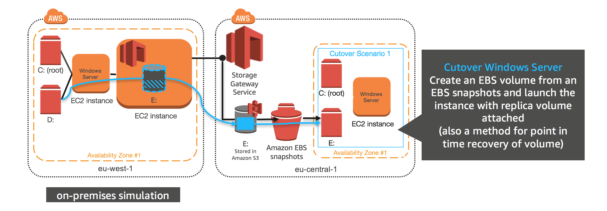
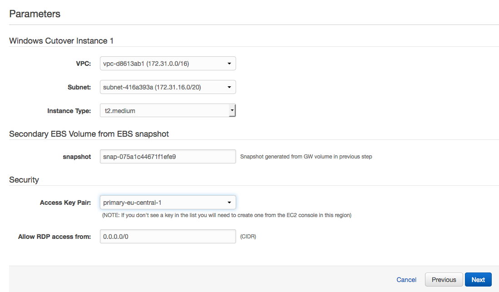
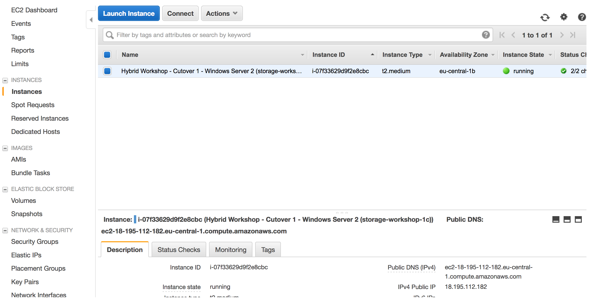
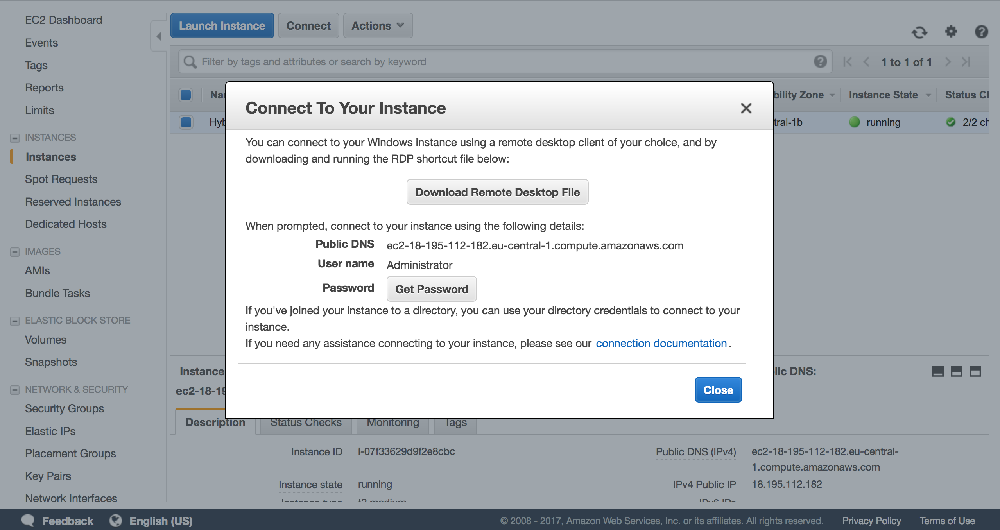

#  Cutover data volume to Amazon EBS in Frankfurt (eu-central-1)

## Introduction

In this module, you will launch an EC2 instance with a secondary EBS volume created from the snapshot of your gateway volume from the previous module. You will RDP connect to the new instance and verify all expected data is now in the Frankfurt (eu-central-1) region. At which point you will have successfully migrated from a windows instance in Ireland (eu-west-1, simulating on-premises) to a windows instance Fankfurt (eu-central-1, which is just being itself ;) ).

## Architecture overview

### 1.	Deploy Windows Instance with EBS volume using CloudFormation in Frankfurt (eu-central-1)

<strong>CloudFormation Launch Instructions (expand for details)</strong>

1.	Right click the **Launch Stack** link below and "open in new tab"

Region| Launch
------|-----
EU (Frankfurt) | -update.json)

2. Click **Next** on the Select Template page.
3. Select your default VPC and any one of the subnets within that VPC.
4. Leave Instance type as t2.medium
5. Enter the snapshot ID from the last module (this will be the basis for the EBS volume that is created with this instance)
6. If you already have an Access Key Pair for this region that you have access to, enter that key pair.  Otherwise, you will need to create a new key pair. ([Creating a key pair using amazon EC2](http://docs.aws.amazon.com/AWSEC2/latest/UserGuide/ec2-key-pairs.html#having-ec2-create-your-key-pair))
7. Click **Next**.

8. Click **Next** Again. 
9. Click **Create**.

Once the CloudFormation stack shows a status of CREATE_COMPLETE, you are ready to move on to the next step.

Note: Instances that are launched as part of this CloudFormation template may be in the initializing state for few minutes.

## 2. Connect the EC2 instance in Frankfurt (eu-central-1) via RDP

<strong>Connect to your EC2 instance (expand for details)</strong>

1.	From the AWS console, click **Services** and select **EC2**  
2.	Select **Instances** from the menu on the left.
3.	Wait until the newly create instance shows as *running*.

4. Right click on your newly provisoined instance and select **connect** from the menu.
5. Click **Get Password** and select your file .pem (Key Pair), this will decrypt ec2 instance administrator password. Keep a copy of the password for your RDP client.
6. Click **Download Remote Desktop File** and open the file with your RDP client
7. Use the password from step 5 to authenticate and connect your RDP client to your windows instance

Note: For detailed instructions on How To connect to your Windows instance using an RDP client ([Connecting to Your Windows Instance](http://docs.aws.amazon.com/AWSEC2/latest/WindowsGuide/connecting_to_windows_instance.html))

After Windows console has launched, open Disk Management by right clicking the Windows logo in the lower-left corner and select the **Disk Management**. You will see a new Offline Disk 1. This contains a copy of the volume from the Volume Gateway you deployed in module 2. Bring the volume online by right-clicking the section describing the disk and selecting **Online**.

## Validation Step

<strong>Verify sample data exists on your EC2 instance (expand for details)</strong>

Check the new D: drive in File Explorer and you should see all the data that was on the original volume that was cloned.

### What just happened?

This is a method of migrating data, using an EBS snapshot of the Volume Gateway volume, enables minimal downtime during cutover to AWS since all of the data already resides at AWS. This is optimal for large data drives that exist on file servers, database servers, web servers and any other system that needs to store large amounts of data locally. 

In this module, a new Windows EC2 instance was launched in AWS Frankfurt (eu-central-1) region with an attached EBS volume created from the EBS snapshot that you created from the Volume Gateway volume in the last module. Since the data from our gateway has been residing in Frankfurt (eu-central-1) region, it it a simple operation to create EBS snapshots from the volume and present them as native EBS volumes to EC2 instances.

You now have a Windows instance in Frankfurt (eu-central-1) that contains a boot volume and a data volume. The data volume is a copy of the data that was hosted by the gateway volume in module 2 (drive E:). At this point you have successfully migrated data from a region simulating an on-premises deployment to the Frankfurt (eu-central-1) region. 

### Start next module

Module 4: [Cutover data volume to a remote location London (eu-west-2)](../module-4/README.md)

## License

This sample code is made available under the MIT-0 license. See the LICENSE file.

[Back to the main workshop scenarios page](../../README.md)
