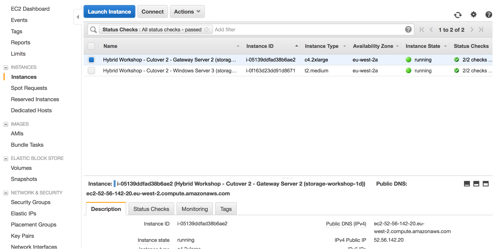
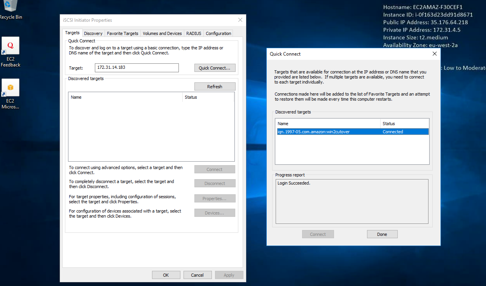
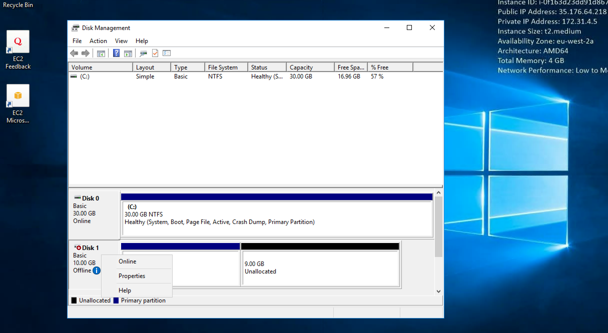
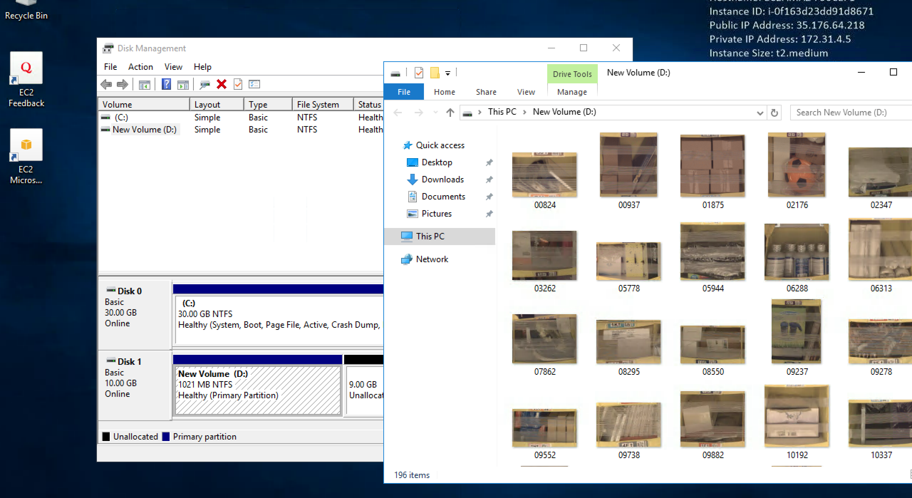

#  Cutover data volume to a remote location eu-west-2

## Introduction

In this module, you will cutover to a tertiary region (London eu-west-2), which could very well be anywhere, including a private DR datacenter. In this module you will deploy a new gateway, a clone on the first gateway volume from module 2 and windows OS (instance) that will mount the volume. This module demonstrates how you can clone gateway volume hosted in an AWS region and present it anywhere that has internet connectivity and the ability to host the gateway OS on a supported hypervisor (Amazon EC2, VMware, Hyper-V).

You can launch this AWS CloudFormation template in the eu-west-2 region to build the necessary resources automatically.

## Architecture overview

### 1.	Deploy Gateway & Windows Instance in Frankfurt (eu-central-1)

<strong>CloudFormation Launch Instructions (expand for details)</strong>

1.	Right click the **Launch Stack** link below and "open in new tab"

Region| Launch
------|-----
EU (London) | .json)

2. Click **Next** on the Select Template page.
3. Select your default VPC and any one of the subnets within that VPC.
4. Leave the Windows Instance Type as t2.medium
5. Leave the Gateway Instance Type as c4.2xlarge
6. Leave the cache and upload buffer sizes as 10GiB
7. Leave the activation region as (eu-central-1), which is where our volume data resides.
8. Select the key pair from the last module
9. Leave the **Allow DRP access from** field as 0.0.0.0/0 or enter the public IP of the computer from which you plan to access the Windows server.  You can find your public IP address at http://www.whatismypublicip.com/

10. Click **Next**.
11. Click **Next**. (skipping IAM advanced section)

8.	On the Review page, check the box to acknowledge that CloudFormation will create IAM resources and click **Create**.

Once the CloudFormation stack shows a status of CREATE_COMPLETE, you are ready to move on to the next step.

## 2. Check your windows and gateway instances

<strong>Check to state of your new instances in London (expand for details)</strong>

1. From the **Services** drop-down, select **EC2**.
2. Select **instances** from the side menuw
3.	Refresh the **instances** view until you see a new c4.2xlarge instance with the name "Hybrid Workshop - Cutover 2 - Gateway Server 2 (storage-workshop-1d)" and a t2.medium with the name "Hybrid Workshop - Cutover 2 - Windows Server 3 (storage-workshop-1d)". Wait for both these instances pass their status checks before continuing.

## 3. Clone volume from Gateway-Server-1 to Gateway-Server-2 for access in London

<strong>Clone volume from Gateway-Server-1 to Gateway-Server-2 for access in London (expand for details)</strong>

4. From the Services drop-down, select **Storage Gateway**.
5. Click on **London** in the upper-right corner and select **EU (Frankfurt)** from the list to switch the console to the eu-central-1 region.
You will now see the Gateway that you just provisioned listed named "Hybrid-Workshop-Gateway-Server-**2**" in addition to the Gateway you provisioned in Module 2. Verify that the Status is *‘Running’*.
6. Click on the new gateway named "Hybrid-Workshop-Gateway-Server-**2**" to reveal the Details tab below. From the Details tab, make note of the IP address of the gateway and write it below.
7.	Click Volumes from the left menu. You will see a single volume which you created in Module 2. We will now create a new volume on the new gateway by cloning the existing volume. Click the **Create Volume** button.
19.	Select the new gateway from the list. You many need to hover over the options to verify the gateway name matches ends in "Gateway Server **2**".
8.	Select a capacity that is larger or equal to your last gateway volume.
9.	Select Clone from last recovery point for the Volume contents
10.	For the Source volume, select your existing volume from the gateway created in Module 2. (should be the only volume in the list)

11.	Enter a name for the iSCSI target (ex ‘win2cutover’) and click Create volume.
12.	Click Skip to bypass CHAP configuration.

You will now see the new volume listed in the AWS Storage Gateway console

## 4. Connect to the new windows instance in London

<strong>Connect to the windows instance in London (expand for details)</strong>

1. Click **Frankfurt** in the upper-right corner of the page, and select **EU (London)** to return to the eu-west-2 region.
2. From the AWS console, click **Services** and select **EC2**.
3. Select **Instances** from the menu on the left.

4. Right click on your newly provisoined *windows* instance and select **connect** from the menu.
5. Click **Get Password** and use your .pem to access the RDP administrator password. Keep a copy of the password for your RDP client.
6. Click **Download Remote Desktop File** and open the file with your RDP client.
7. Use the password from step 5 to authenticate and connect your RDP client to your windows instance.

Note: For detailed instructions on How To connect to your Windows instance using an RDP client ([Connecting to Your Windows Instance](http://docs.aws.amazon.com/AWSEC2/latest/WindowsGuide/connecting_to_windows_instance.html))

## 5. Connect to cloned volume from windows instance in London

We will now attach the volume from your new Volume Gateway in Frankfurt to your Windows instance in London just as we did in Module 2, giving that instance access to the clone volume we are hosting in Frankfurt. 

<strong>Connect to cloned volume (expand for details)</strong>

  
1. From your Windows instance, open the iSCSI Initiator utility by clicking the Windows logo in the bottom left corner and typing ‘iscsi’ and then clicking iSCSI Initiator from the search results.

2. Click ‘Yes’ if prompted to enable the iSCSI service in Windows

3.	In the Targets tab of the iSCSI Initiator Properties window, enter the *IP address* that you wrote down for your Volume Gateway in the Quick Connect section and click the **Quick Connect** button. 

You should see a target listed now with Connected status: *Connected*

Your Windows instance is now connected with the Volume Gateway via iSCSI and the only volume that exists has been discovered by Windows and connected. This is your cloned volume, which is now mountable in London from Frankfurt

5. Click **Done** and **OK** to close the iSCSI Initiator Properties window.

6. Now open Disk Management by right clicking the Windows logo in the lower-left corner and select the **Disk Management**. You will see a new Offline Disk 1. This contains a copy of the volume from the Volume Gateway you deployed in module 2. Bring the volume online by right-clicking the section describing the disk and selecting **Online**.

## Validation Step - Scenario Complete!

<strong>Verify sample data exists on your EC2 instance (expand for details)</strong>

Check the new D: drive in File Explorer and you should see all the data that was on the original volume that was cloned.

### What just happened?

We deployed a whole new AWS Storage Gateway and associated Windows Instance in a completely different location to the orginal gateway. This effectively allowed us to present a clone from one location in the world to another completely different location in the world. We used the newly deployed windows isntance to confirm that all the data we expected arrived at it's final destionation (London).

This is an alternative method of migrating data, using a clone of an existing Volume Gateway volume. Instead of creating a new volume using EBS snapshots, which are exclusive to AWS regions. The main benefit of this method is that you can present cloned volumes to either AWS or in any other location/hypervisor that supports running the AWS storage gateway OS, including in private datacenters.

## Workshop Cleanup

To make sure all resources are deleted after this workshop scenario make sure you execute the follow steps in the order outlined below:

1. Delete the two storage gateways from the storage gateway console in Frankfurt (eu-central-1)
2. Destroy the cloud formation stack in eu-west-2 named "storage-workshop-2d"
2. Destroy the cloud formation stack in eu-central-1 named "storage-workshop-2c"
2. Destroy the cloud formation stack in eu-west-1 named "storage-workshop-2b" (wait for it to complete before deleting the next one)
2. Destroy the cloud formation stack in eu-west-1 named "storage-workshop-2a"

## License

This library is licensed under the Amazon Software License.

[Back to the main workshop scenarios page](../../README.md)
