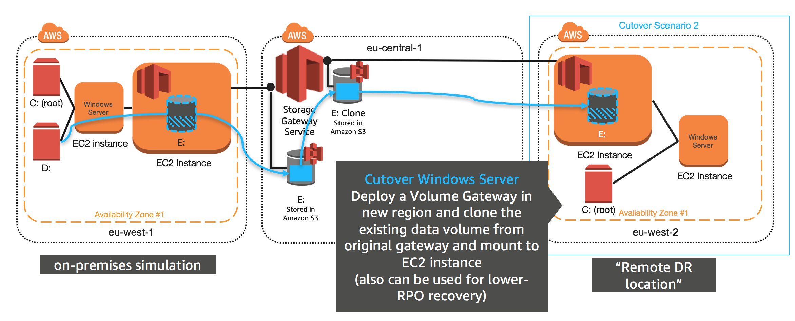
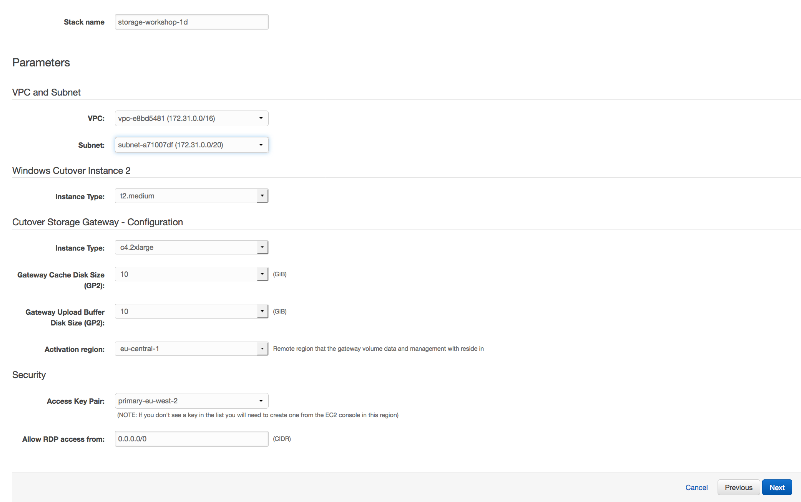

#  Cutover data volume to a remote location eu-west-2

## Introduction

In this module, you will cutover to a tertiary region (London eu-west-2), which could very well be anywhere, including a private DR datacenter. In this module you will deploy a new gateway, a clone on the first gateway volume from module 2 and windows OS (instance) that will mount the volume. This module demonstrates how you can clone gateway volume hosted in an AWS region and present it anywhere that has internet connectivity and the ability to host the gateway OS on a supported hypervisor (Amazon EC2, VMware, Hyper-V).

You can launch this AWS CloudFormation template in the eu-west-2 region to build the necessary resources automatically.

## Architecture overview

### 1.	Deploy Gateway & Windows Instance with EBS volume using CloudFormation in Frankfurt (eu-central-1)

<strong>CloudFormation Launch Instructions (expand for details)</strong>

1.	Right click the **Launch Stack** link below and "open in new tab"

Region| Launch
------|-----
EU (London) | .json)

2. Click **Next** on the Select Template page.
3. Select your default VPC and any one of the subnets within that VPC.
4. Leave the Windows Instance Type as t2.medium
5. Leave the Gateway Instance Type as c4.2xlarge
6. Leave the cache and upload buffer sizes as 10GiB
7. Leave the activation region as (eu-central-1), which is where our volume data resides.
8. Select the key pair from the last module
9. Leave the **Allow DRP access from** field as 0.0.0.0/0 or enter the public IP of the computer from which you plan to access the Windows server.  You can find your public IP address at http://www.whatismypublicip.com/

10. Click **Next**.
11. Click **Next**. (skipping IAM advanced section)

8.	On the Review page, check the box to acknowledge that CloudFormation will create IAM resources and click **Create**.

Once the CloudFormation stack shows a status of CREATE_COMPLETE, you are ready to move on to the next step.

## 2. Check your instances and configure your gateway with a cloned volume

<strong>Connect to your EC2 instance (expand for details)</strong>

1. From the **Services** drop-down, select **EC2**.
2. Select **instances** from the side menuw
3.	Refresh the **instances** view until you see a new c4.2xlarge instance with the name "Hybrid Workshop - Cutover 2 - Gateway Server 2 (storage-workshop-1d)" and a t2.medium with the name "Hybrid Workshop - Cutover 2 - Windows Server 3 (storage-workshop-1d)". Wait for both these instances pass their status checks before continuing.
4. From the Services drop-down, select **Storage Gateway**.
5. Click on **London** in the upper-right corner and select **EU (Frankfurt)** from the list to switch the console to the eu-central-1 region.
You will now see the Gateway that you just provisioned listed named "Hybrid Workshop - Cutover 2 - Gateway Server **2** " in addition to the Gateway you provisioned in Module 2. Verify that the Status is *‘Running’*.
6. Click on the new gateway named "Hybrid Workshop - Cutover 2 - Gateway Server **2** " to reveal the Details tab below. From the Details tab, make note of the IP address of the gateway and write it below.
7.	Click Volumes from the left menu. You will see a single volume which you created in Module 2. We will now create a new volume on the new gateway by cloning the existing volume. Click the **Create Volume** button.
19.	Select the new gateway from the list. You many need to hover over the options to verify the gateway name matches ends in "Gateway Server **2**".
8.	Select a capacity that is larger or equal to your last gateway volume.
9.	Select Clone from last recovery point for the Volume contents
10.	For the Source volume, select your existing volume from the gateway created in Module 2.
11.	Enter a name for the iSCSI target (ex ‘win2cutover’) and click Create volume.
12.	Click Skip to bypass CHAP configuration.

You will now see the new volume listed.

25.	Click Frankfurt in the upper-right corner of the page, and select EU (London) to return to the eu-west-2 region.

26.	We will now attach the volume from your new Volume Gateway in Frankfurt to your Windows instance in London just as we did in Module 2, giving that instance access to both local storage in that region, and storage in Frankfurt. 
Return to your Windows instance, and open the iSCSI Initiator utility by clicking the Windows logo in the bottom left corner and typing ‘iscsi’ and then clicking iSCSI Initiator from the search results.

## Validation Step

<strong>Verify sample data exists on your EC2 instance (expand for details)</strong>

Check the new D: drive in File Explorer and you should see all the data that was on the original volume that was cloned.

### What just happened?

This is a method of migrating data, using an EBS snapshot of the Volume Gateway volume, enables minimal downtime during cutover to AWS since all of the data already resides at AWS. This is optimal for large data drives that exist on file servers, database servers, web servers and any other system that needs to store large amounts of data locally. 

In this module, a new Windows EC2 instance was launched in AWS (eu-central-1 region) with the migrated data mounted from an EBS snapshot that you created from the Volume Gateway volume which was being hosting in the Frankfurt region (even when it was being presented to Ireland region via the EC2 gateway in that region).

You now have a Windows instance in eu-central-1 that contains a boot volume and a data volume. The secondary volume is a copy of the data that was hosted by the gateway volume in module 2 (drive E:). At this point you have successfully migrated data from a region simulating an on-premises deployment to the Frankfurt eu-central-1 region. 

### Start next module

Module 4: [Cutover data volume to a remote location eu-west-2](../module-4/README.md)

## License

This library is licensed under the Amazon Software License.

[Back to the main workshop scenarios page](../../README.md)
