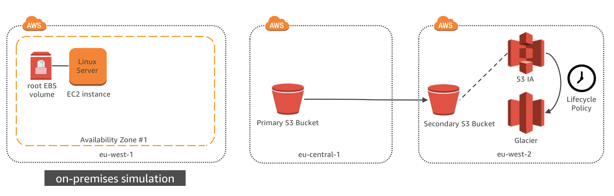

# Configure S3 Storage Solution with CRR and Lifecycle Policy

## License

This library is licensed under the Amazon Software License.

## Introduction

In this module, you will deploy a Linux EC2 instance to simulate on-premises server with a root EBS volume with media data on it in the eu-west-1 (Ireland) AWS region. You will also create two S3 buckets in two different regions and configure advanced S3 features: S3 Lifecycle Policies and Cross Region Replication (CRR).

## Architecture Overview

The EC2 instance in eu-west-1 is to simulate the physical server in on-premises data center and will be used in next module to use an on-premises file storage gateway solution.  The EC2 instance use EBS volume as root volume with file data. 

S3 bucket for file gateway will be created in eu-central-1, which is the primary data backup location. Another S3 Bucket in eu-west-2 will be created as the replica copy of S3 file as part of a Data Recovery solution.  Cross-region replication will be enabled on the primary S3 bucket to replicate the same data to the replica S3 bucket.  Primary S3 bucket will be used in module 2 as part of file storage gateway service. 

In addition, S3 lifecycle policy will be created to change the data older than 30 days in S3 replica bucket from S3 standard class to S3 Glacier class to save the cost.   

## Implementation Instructions

### 1.	Deploy Linux Instance using CloudFormation Template

The first step is to deploy an EC2 instance with some data in eu-west-1 to simulate a Linux server running in a non-AWS location.

You can launch a customized instance using the following AWS CloudFormation template in the eu-west-1. The template will launch an instance, download a sample dataset to the instance and setup a security group for ssh access.

Region| Launch| Tip
------|-----|-----
EU (Ireland) | .json) | Right click and open in new tab

### CloudFormation Launch Instructions

1.	Right click the **Launch Stack** link above and "open in new tab"

2.	Click **Next** on the Select Template page.
3.	Select your default VPC and any one of the subnets within that vpc.  Note the subnet need to have a IGW attached.
4.	If you already have an Access Key Pair for this region that you have access to, enter that key pair.  Otherwise, you will need to create a new key pair. [creating a key pair using amazon EC2](http://docs.aws.amazon.com/AWSEC2/latest/UserGuide/ec2-key-pairs.html#having-ec2-create-your-key-pair)
5.	Leave the Allow SSH access from as 0.0.0.0/0 or enter the public IP of the computer from which you plan to access the Windows server.  You can find your public IP address at http://www.whatismypublicip.com/
6.	Click Next.

