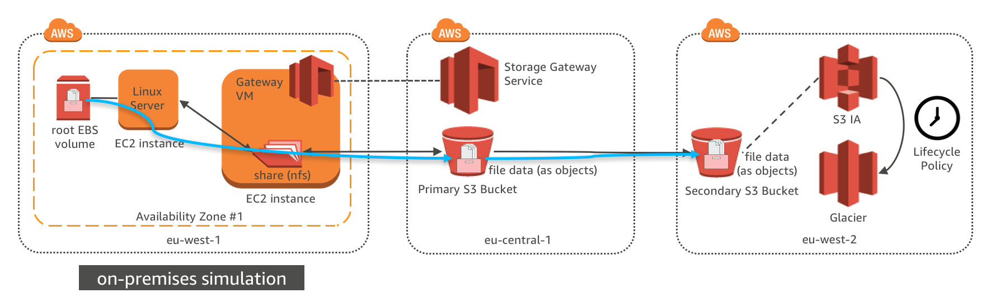
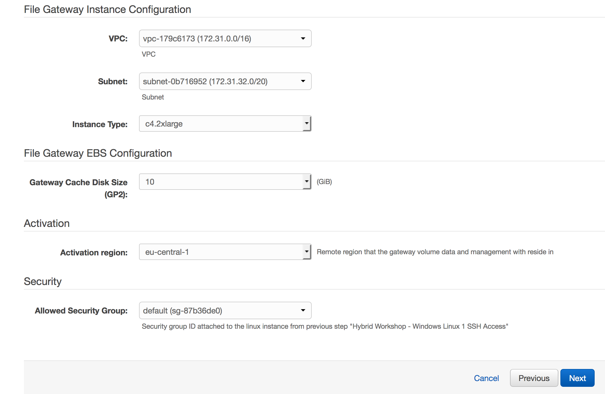
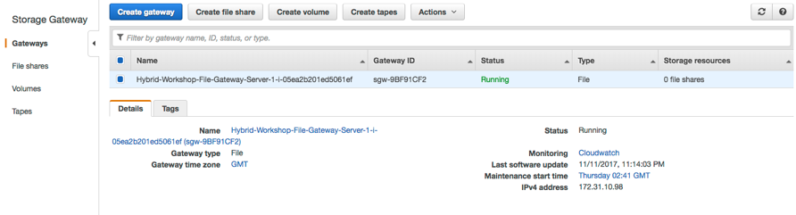
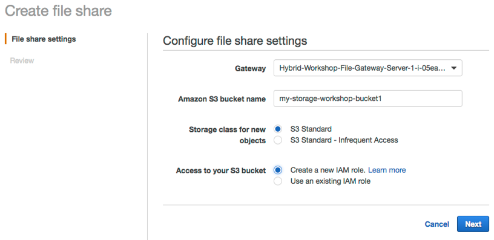
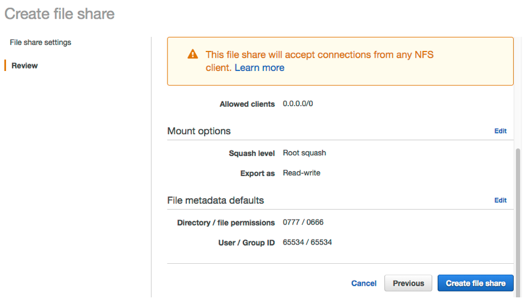
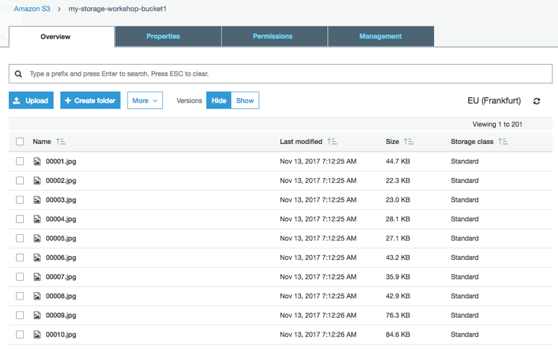
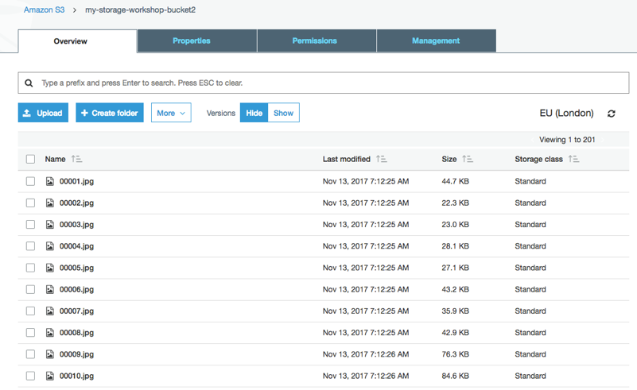

# Deploy AWS Storage Gateway in File mode and integrate with S3

## Introduction

In this module, you’ll deploy AWS storage gateway in file mode in the same network as the the Linux instance created in module 1.  You will use AWS storage gateway’s ability to present an NFS mount point to a private data center and store files in AWS S3 in other regions, which is highly available and durable.

## Architecture Overview



The EC2 instance in eu-west-1 is to simulate the physical server in on-premises data center and a storage gateway is deployed on another EC2 instance to act as an on-premises file storage gateway.

The Linux EC2 instance use NFS mount to connect to the file gateway.  Media files are copied to file server, which actually store all files in AWS S3 bucket in the other region. The cross region replication and lifecycle policy configured in module 1 will also be applied to the new S3 data.

## Implementation Instructions

### 1. Deploy Storage Gateway using CloudFormation Template

In order to give our Linux instance access to S3 over NFS, we first need to deploy a storage gateway in the same region as the Linux instance. To do this you can use the CloudFormation template below.

<details>
<summary><strong>CloudFormation Launch Instructions (expand for details)</strong></summary><p>

1.	Right click the **Launch Stack** link below and "open in new tab"

Region| Launch
------|-----
EU (Ireland) | [](https://console.aws.amazon.com/cloudformation/home?region=eu-west-1#/stacks/new?stackName=storage-workshop-2b&templateURL=https://s3-us-west-2.amazonaws.com/hybrid-storage-workshop/scenario2-step2-migrate-FGW1-(eu-west-1).json)

2.  Click **Next** on the Select Template page.
3.	Select the VPC and subnet where the Linux instance was created in module 1
4.	Select the security group that start with "storage-workshop-2a-linux1SecurityGroup" (This will allow the Linux instance network access to the storage gateway instance)
5.	Click **Next**.



6.	Click **Next** Again. (skipping IAM advanced section)
7.	On the Review page, check the box to acknowledge that CloudFormation will create IAM resources and click **Create**.

Once the CloudFormation stack shows a status of CREATE_COMPLETE, you are ready to move on to the next step2

Note: it may take some time for the gateway to activate. You can see the activation status of the gateway in the Name of the EC2 instance in eu-west-1

</p></details>

### 2. Configure storage Gateway in eu-central-1 region

From the AWS Management Console, select **Storage Gateway** from within services and select EU (Frankfurt) as the region.  You should see a storage gateway already created and activated in previous step.

<details>
<summary><strong>(expand for screenshot)</strong></summary><p>


</p></details>

### 3. Create a file share connected to your primary S3 bucket

A file share can be created on the storage gateway to be used by NFS client. The file share also connects to the S3 bucket where the data is actually stored in the form of objects. Unix file permissions for each file and folder are stored as object metadata within objects in S3.

<details>
<summary><strong>Step-by-step instructions (expand for details)</strong></summary><p>

1.	Select the gateway named "Hybrid-Workshop-File-Gateway-Server-1..." then click **Create file share**.
2.	In the Create file share wizard, select the storage gateway that is created, input the name of the first S3 bucket we created in first module, and select Create a new IAM role. Then click **Next**.



3.	Choose Next to review configuration settings. (Note: Leaving the defaults in this lab scenario is fine however, in real deployments consider limiting access by IP.)



4.	Review your file share configuration settings, and then click **Create file share**. After your file share is created, you can select the share see your file share settings in the file share Details pane at the bottom of the console.
</p></details>

### 4. Mount the bucket over NFS on your Linux instance

At this point you can mount the file share on the Linux NFS client and gain access to the associated S3 bucket.

<details>
<summary><strong>Step-by-step instructions (expand for details)</strong></summary><p>

1.	SSH into the Linux Instance created in module 1
2.	Create the directory that will contain the NSF shared files

`sudo mkdir -p /mnt/nfs/s3`

3.	Mount your file share, the mount command can be found from

`# sudo mount -t nfs -o nolock [Your gateway VM IP address]:/[mount path on your client] [MountPath]`

For Example:
`sudo mount -t nfs -o nolock 172.31.10.98:/my-storage-workshop-bucket1 /mnt/nfs/s3`

4.	Check the directory has been mounted using df or mount command

```
df –h
mount
```

Example output:

```
[ec2-user@ip-172-31-11-236 data]$ df -h
Filesystem                                 Size  Used Avail Use% Mounted on
devtmpfs                                   488M   60K  488M   1% /dev
tmpfs                                      497M     0  497M   0% /dev/shm
/dev/xvda1                                 7.8G  1.1G  6.7G  14% /
172.31.10.98:/my-storage-workshop-bucket1  8.0E     0  8.0E   0% /mnt/nfs/s3
```

</p></details>

### 5. Copy data from EBS on Linux to the mounted file share
In this module, we will use the Linux instance created in module 1 as NFS client and copy our sample data to S3 using standard linux commands.

<details>
<summary><strong>Step-by-step instructions (expand for details)</strong></summary><p>

1. In Linux test instance, copy media file to file gateway

```
cd /media/data/
cp -v *.jpg /mnt/nfs/s3/
```
</p></details>

## Implementation Validation
### 1. Access the content in the primary S3 bucket

<details>
<summary><strong>Step-by-step instructions (expand for details)</strong></summary><p>

1. In the Amazon S3 management console, navigate to your primary bucket and check to see that the 200 images files are stored as objects within.


</p></details>

### 2. Verify S3 cross region replication is replicating objects to the secondary S3 bucket in eu-west-2.

<details>
<summary><strong>Step-by-step instructions (expand for details)</strong></summary><p>

1. In  the Amazon S3 management console, view the content under S3 replica bucket. It should display the same 200 JPEG files in the region of EU (London).



</p></details>

## Scenario complete

Congratulation you have completed the second scenario. In this workshop you successfully copied data from an nfs client in eu-west-1 to a primary S3 bucket in eu-central-1. Additionally, objects written in the primary bucket were replicated to a secondary bucket in eu-west-2. These objects will be life cycled to glacier after 30 days and in the real world might be kept to safeguard against accidental deletions that may occur the the primary objects in the primary S3 bucket.

## Workshop Cleanup

To make sure all resources are deleted after this workshop scenario make sure you execute the follow steps in the order outlined below:

1. Delete the file gateway from the storage gateway console in eu-central-1
2. Delete the buckets in eu-central-1 and eu-west-2
3. Destroy the cloud formation stack in eu-west-1 named "storage-workshop-2b" (wait for it to complete before deleting the next one)
4. Destroy the cloud formation stack in eu-west-1 named "storage-workshop-21"

[Back to the workshop scenarios page](../../README.md)


## License

This library is licensed under the Amazon Software License.
